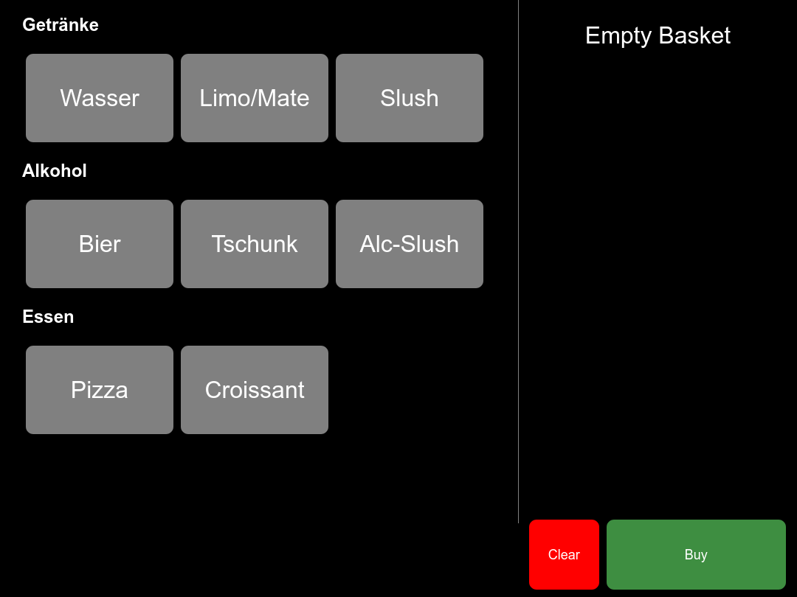

# Taler POS



A point of sale (POS) webapp for GNU Taler

## Setup

`git clone --recursive https://github.com/SpitfireX/taler-pos /var/www/whatever` and have your favourite
web server serve these files.

Then, serve one (or more) [GNU Taler merchant POS configuration](https://docs.taler.net/taler-merchant-pos-terminal.html#apis-and-data-formats) JSON files. An example file could look like this:

```json
{
    "config": {
        "base_url": "https://merchant-backend.example.org/instances/foobar",
        "api_key": "secret-token:verysecretstuff23"
    },
    "categories": [
        { "id": 1, "name": "Food" }
    ],
    "products": [
        {
            "product_id": "1",
            "description": "Pizza",
            "price": "KUDOS:13.37",
            "categories": [1],
            "delivery_location": "mylocation"
        }
    ],
    "locations": {
        "mylocation": {
            "name": "Food desk",
            "country": "Germany",
            "state": "",
            "region": "",
            "province": "",
            "city": "Somewhere",
            "zip_code": "",
            "street": "",
            "street_number": ""
        }
    }
}
```

## Attributions

This repo contains the file `Eo_circle_green_checkmark.svg` licensed under CC BY-SA 4.0, derived from Emoji One, original at [https://commons.wikimedia.org/wiki/File:Eo_circle_green_checkmark.svg](https://commons.wikimedia.org/wiki/File:Eo_circle_green_checkmark.svg)
